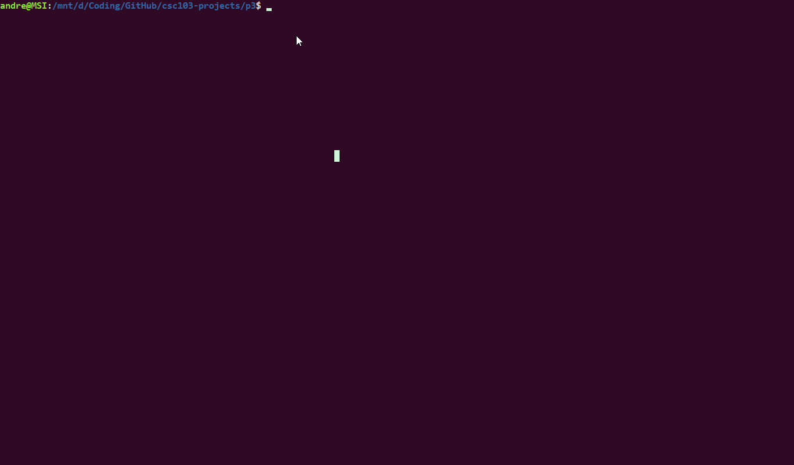

# Game of Life

Game of Life is a C++ projects that resemble as <a href="https://en.wikipedia.org/wiki/Conway%27s_Game_of_Life">Conway's Game of Life</a>. It implements the data structure vector and file handling. While running the program, it takes an input text file with a two-dimensional orthogonal grid of square cells which contains **.** and **O**.


## Usage
First, clone the project and go to the target directory
```bash
git clone https://github.com/YihuiAndre/csc103-projects.git
cd csc103-projects/p3/
```
Second, compile the C++ file using the MakeFile
```bash
make
```
Third, run the following command to display the output
```bash
./life -s res/acorn-110x60 &
watch -n 1 "cat /tmp/gol-world-current"
```
Forth, stop the program by typing **CTRL+C** and kill the program by the following command
```bash
pkill -x life
```


## Demonstrations
